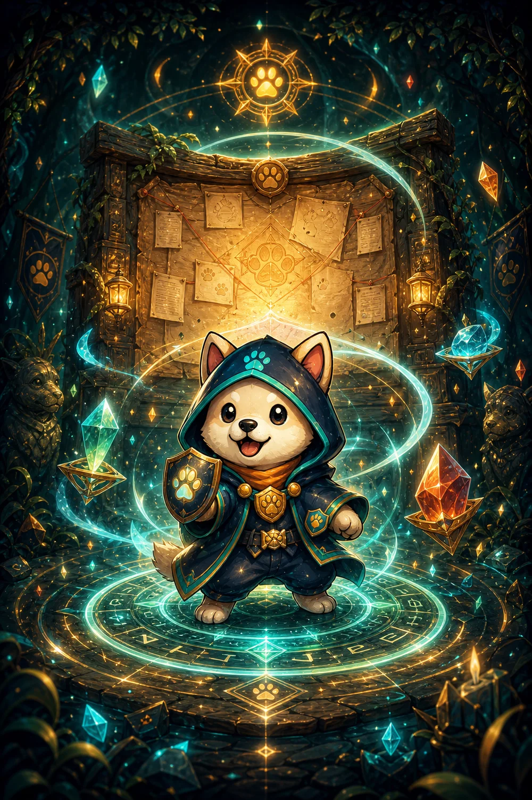
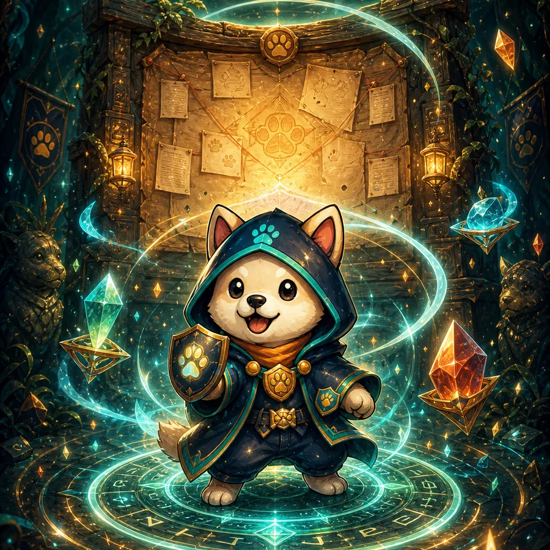
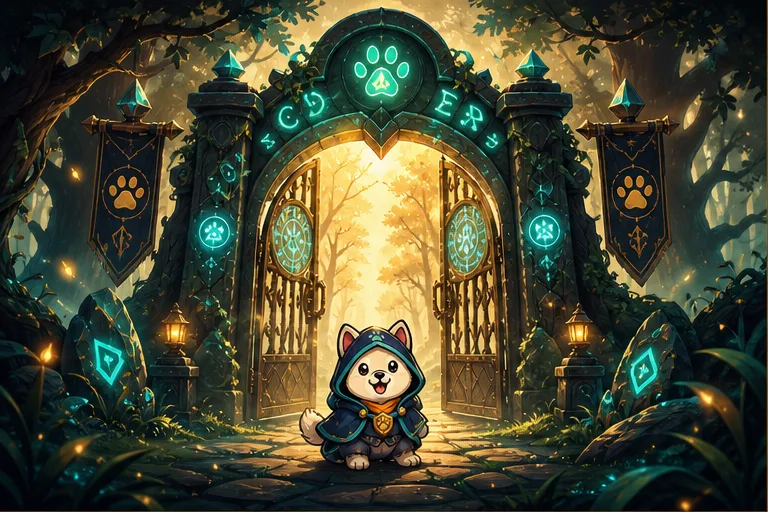
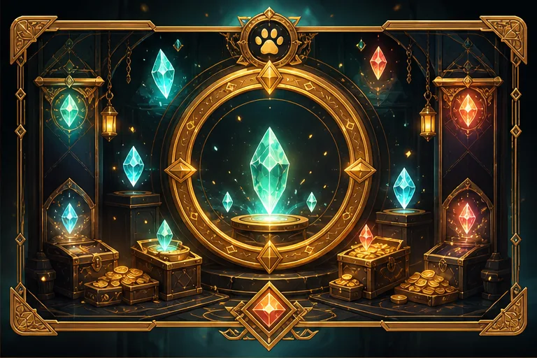
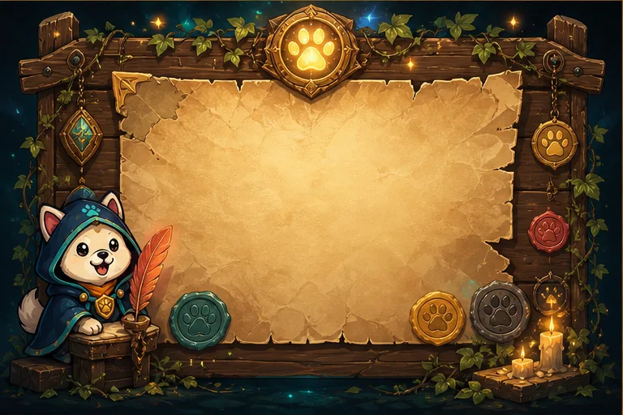
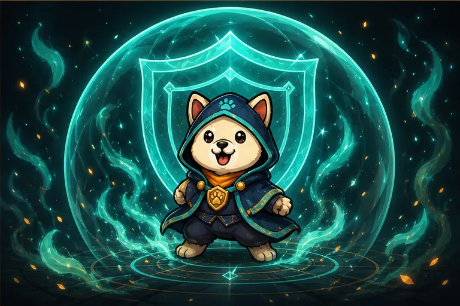

# KishuGuardian

Public asset repository for KishuGuardian profile, banner, and website imagery.

## Images

| Asset | Preview |
| --- | --- |
| `KishuGuardian Profile Pic1.png` |  |
| `KishuGuardian Big Banner2.png` |  |

## Telegram Bot Description

Short description:

```text
KishuGuardian watches the gate for Kishu spaces, links, updates, and future doorman verification.
```

Full description:

```text
Guardian of Kishu.

KishuGuardian is the public shield for Kishu-focused community spaces, links, and assets. Follow for verified KishuGuardian updates now; future group access tools will help welcome real humans and keep spam, clones, and impostors outside the gate.

https://KishuGuardian.com
https://t.me/KishuGuardian
https://github.com/KishuGuardian

#kishuguardian #kishuguard
```

## Website Artwork

These generated website images are also KishuGuardian-owned identity assets and
are covered by the same use restrictions below.

| Asset | Preview |
| --- | --- |
| `Assets/Website/guardian-action.webp` |  |
| `Assets/Website/loadscreen-guardian.webp` |  |
| `Assets/Website/world-panel-0.webp` |  |
| `Assets/Website/world-panel-1.webp` |  |
| `Assets/Website/world-panel-2.webp` |  |
| `Assets/Website/world-panel-3.webp` |  |

## Platform Exports

These files are resized/cropped exports for specific platform profile fields.
They are also copyrighted KishuGuardian assets covered by the same restrictions.

| Asset | Purpose | Preview |
| --- | --- | --- |
| `Assets/KishuGuardian Profile Pic1 - Rarible Avatar 400x400.png` | Rarible avatar, 400x400 PNG |  |
| `Assets/KishuGuardian Big Banner2 - Rarible Cover 1440x260.png` | Rarible cover, exact crop, 1440x260 PNG |  |
| `Assets/KishuGuardian Big Banner2 - Rarible Cover 1440x260 safe.png` | Rarible cover, safer head crop, 1440x260 PNG |  |
| `Assets/KishuGuardian Big Banner2 - Telegram Bot Banner 640x360.png` | Telegram bot banner, exact 640x360 PNG using the original banner with generated top/bottom extension |  |
| `Assets/KishuGuardian Big Banner2 - Telegram Bot Profile 640x640.png` | Telegram bot profile picture for `@KishuGuardianBot`, exact 640x640 PNG cropped from the bot description banner |  |
| `Assets/KishuGuardian Banner2 - Telegram Bot Banner 640x360.png` | Telegram bot alternate banner, exact 640x360 PNG using Banner2 with same-image stretched top/bottom extension |  |
| `Assets/KishuGuardian Channel Profile Picture 1024x1024.png` | Telegram channel profile picture, 1024x1024 PNG with public guardian-hall background, not for bots |  |
| `Assets/KishuGuardian Private Group Profile Picture 1024x1024.png` | Telegram private group profile picture, 1024x1024 PNG with protected-gate background, not for bots |  |

## Copyright And Use Restrictions

All images in this repository, including the profile picture, banner, compressed
versions, platform exports, and generated website artwork, are copyrighted works
owned by KishuGuardian, the creator and rights holder of the images.

These images are published here for public viewing and identity reference only.
No license or permission is granted to any other person, project, company, bot,
token, community, marketplace, or website to use, copy, reproduce, modify,
redistribute, publish, sell, mint, tokenize, train on, or create derivative works
from these images.

Only KishuGuardian has the right to use these images unless KishuGuardian gives
explicit written permission in advance.

Anyone who uses, copies, reposts, mints, tokenizes, sells, trains on, or
otherwise exploits these images without written permission may be held
financially responsible for resulting damages, profits, enforcement costs, legal
fees, platform fees, and any other remedies available under applicable law.

All rights reserved.
